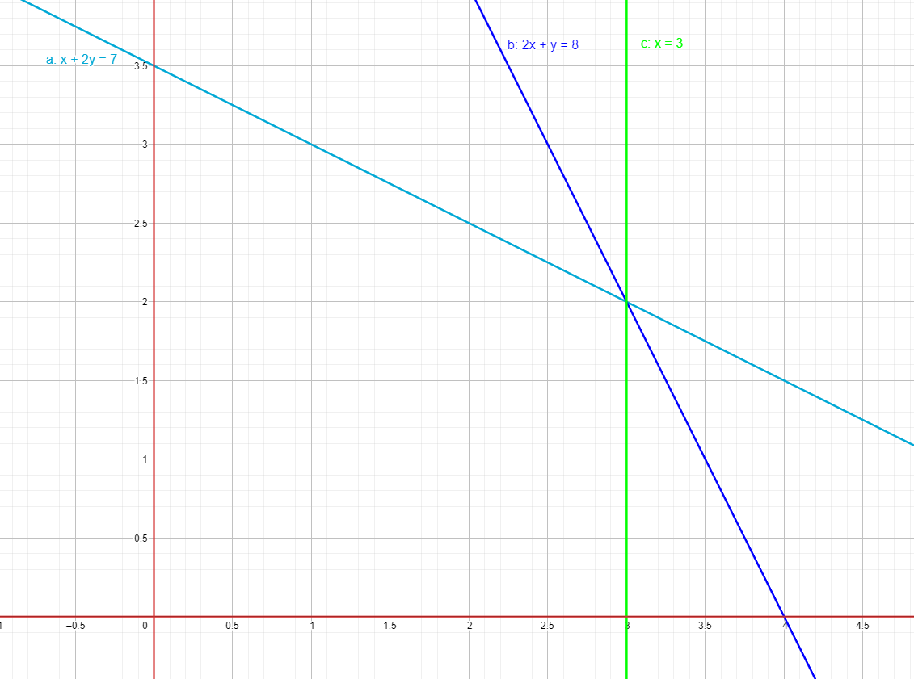

# Лабораторная работа №3

## Вопросы

### 1. Общая и каноническая форма задачи линейного программирования
Общая
$$
\begin{array}{ll}
\sum{c_j x_j} \to \max{}\\
\sum{a_{ij} \le b_i}\\
x_j \ge 0
\end{array}
$$

Каноническая
$$
\begin{array}{ll}
\sum{c_j x_j} \to \max{}\\
\sum{a_{ij} = b_i}\\
x_j \ge 0
\end{array}
$$

### 2. Методы естественного базиса. Метод искуственного базиса.

TODO

### 3. Доказать, что ОДР (область допустимых решений) является выпуклым множеством.

Уравнения и неравенства задают полуплоскости и другие выпуклые фигуры. Пересечение выпуклых фигур является выпуклым.

### 4. Может ли ОДР в задаче линейного программирования состоять из одной единственной точки? Если да, то привести пример.

Да, может.

$$
\begin{array}{ll}
3 * x_1 - x_2 \to \max{}\\
x_1 + 2 x_2 = 5\\
x_1 + x_2 = 4\\
x_j \ge 0
\end{array}
$$

ОДР - одна точка: $(3, 1)$

### 5. Графический метод решения задачи линейного программирования

В ОДР входит область ниже и левее подписанных прямых и выше и правее красных
Так как как нормаль уровня целевого функционала $(-3, -2)$ и нам нужен минимум, то рассмотрим точку $(3,2)$ как наиболее похожую на ответ. Значений функционала в ней $-13$.
Чтобы проверить что ответ верный, рассмотрим значение целевого функионала в соседних точках. В точке $(3, 0)$ значение $-9$. В точке $(0, 3.5)$ значение $-7$.

### 6. Найти все базисы системы равенств и соответствующие им базисные решения.

| Свободные переменные | Базисное решение |
|----------------------|------------------|
| x1, x2               | 0, 0, 1, 0       |
| x1, x4               | 0, 0, 1, 0       |
| x2, x3               | 1, 0, 0, 0       |
| x2, x4               | a, 0, 1-a, 0     |
| x3, x4               | 1, 0, 0, 0       |

### 7. Выразить базисные переменные через небазисные

В данной системе свободная переменная - $x_3$

$$
x_1=-x_3+1\\
x_2=-x_3+2
$$

### 8. Исследовать на оптимальность решение $x=(0,0,1,1)$

Выразим целевой функционал через свободные переменные

$$
x_1+x_2-2x_3-3x_4 \to \min
$$

$$
x_3=-2x_1+x_2+1\\
x_4=x_1-2x_2+1
$$
$$
2x_1+5x_1-5
$$

Так как в функционале остались переменные с положительными коэффициентами, то уменьшить итогое значение не получится, значит найденное решение оптимально.

